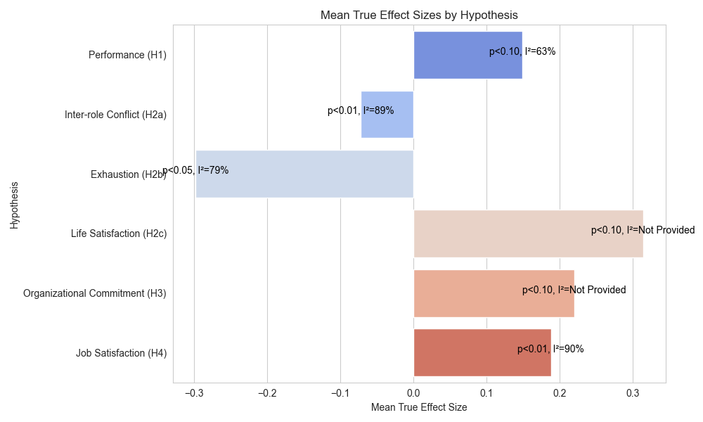

# Dissertation Statistical Analysis Results
## "How To Motivate Remote Employees: A Self-Determination Theory
Perspective"

This document summarizes the statistical analysis results from the dissertation.

## What is Meta-Analysis?
Meta-analysis is a statistical technique used to combine the findings from independent studies to identify patterns, discrepancies, and overall effects across numerous research studies. It goes beyond mere literature review by conducting secondary statistical analysis on the outcomes of relevant studies.
## Why Use Meta-Analysis?
The author chose meta-analysis to systematically review and synthesize existing research on how autonomy impacts remote employees' motivation. This method allows for a comprehensive examination of the collected data, identifying general consensus points, conflicts, and the reliability of the compared studies. It's particularly suited to the dissertation's goal due to the abundance of existing research on Self-Determination Theory (SDT) and its application to remote work environments.
## The Selected Approach
Among various meta-analysis methods, the dissertation utilizes the Hedges and colleagues method, which offers both fixed- and random-effects models. This approach was chosen for its ability to handle the nuances of the studies analyzed, especially considering the potential for diverse outcomes in studies related to autonomy and remote work.
## Statistical Implementation
*Fixed-Effects Meta-Analysis*: The method begins by converting effect sizes into a standard normal metric via Fisher’s r-to-Z transformation, then calculating a weighted average of these transformed scores.
*Calculating Homogeneity of Effect Sizes*: It involves assessing the consistency among study outcomes to ensure they are evaluating the same effect. Homogeneity tests such as Cochrane’s Q statistic and I^2 are employed to examine between-study variance.
*Random-Effects Meta-Analysis*: This part calculates the mean effect size, incorporating both within-study and between-study variances, to address the heterogeneity among studies.

## Hypotheses and Results

| Hypothesis | Mean True Effect Size | Significance Level | Heterogeneity (I^2) |
|------------|-----------------------|--------------------|---------------------|
| Performance (H1) | 0.149 | p<0.10 | 63% |
| Inter-role Conflict (H2a) | -0.072 | p<0.01 | 89% |
| Exhaustion (H2b) | -0.298 | p<0.05 | 79% |
| Life Satisfaction (H2c) | 0.314 | p<0.10 | Not Provided |
| Organizational Commitment (H3) | 0.22 | p<0.10 | Not Provided |
| Job Satisfaction (H4) | 0.188 | p<0.01 | 90% |

## Comments

- The mean true effect sizes indicate the magnitude of the effect autonomy has on various outcomes related to remote work.
- Significance levels suggest the statistical confidence in these effects, with p<0.05 typically considered statistically significant.
- Heterogeneity (I^2) values provide insight into the variability among study results included in the meta-analysis.
